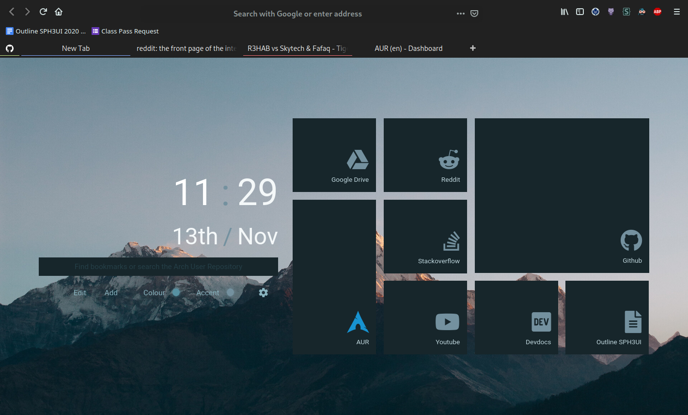

# minimal-functional-fox

This fork involves better fonts and a complete SASS rewrite.

> ###### *A minimal, yet functional configuration for Firefox!*



[](https://github.com/Luke-zhang-04/minimal-functional-fox/blob/master/LICENSE)
------
## Features

- Minimal bloat (non-crucial icons and decorations hidden)

- Easy way to tweak fonts, colors, and spacings to your liking through CSS variables

- Tab list below toolbar

- Tab(s) with sound playing highlighted with a different color

- Centered URL bar with narrow-er results list

- And more!

------

## Prerequisites

* Verify that the user **stylesheets (userChrome)** option is enabled:
  1. Go to the address `about:config` in Firefox

  2. Search for `toolkit.legacyUserProfileCustomizations.stylesheets`

  3. Confirm the option is set to **true**


* Make sure that you have the **Default** theme enabled
  1. Go to the address `about:addons`
  2. **Enable** the **Default** theme if not already enabled


------

## Installation

### Quick Install

You can quickly install minimal functional fox via the command-line by using `curl`:

```bash
sh -c "$(curl -fsSL https://raw.githubusercontent.com/Luke-zhang-04/minimal-functional-fox/master/install.sh)"
```

It is a good idea to inspect the install script for projects you aren't familiar with. To do that, you can download the install script separately, go through it to make sure everything looks OK, then go ahead and run it once you are satisfied:

```bash
curl -Lo install.sh https://raw.githubusercontent.com/Luke-zhang-04/minimal-functional-fox/master/install.sh
sh install.sh
```

**Note:** The install script will create a backup of your existing `userChrome.css`, and `userContent.css` files by renaming them to `userChrome.css~`, and `userContent.css~` respectively in the chrome directory.

### Manual Install

If quick install does not work, or if you simply prefer to; you can manually install  minimal functional fox through the following steps:

1. Locate your Firefox user directory. You should be able to find it by navigating to `/home/.mozilla/firefox/` and looking for a directory ending with the world `.default-release`.
2. Within your Firefox user directory, locate the `chrome` directory, if one does not already exist you can simply go ahead and create it yourself.
3. Download the contents of this repository, and copy *all* the files to the chrome directory within your Firefox user directory.

After installation, restart Firefox to see the effects.

------


## Recommended Tweaks

* Select the **Customize** option from the **hamburger menu** **(≡)**, and remove all items except for:
    * Forward button
    * Back button
    * Downloads button
* The new tab page extension is called **nightTab**. [You can can find it here](https://addons.mozilla.org/en-US/firefox/addon/nighttab/)

------

## Customizing

You can easily tweak the theme by changing the relevant SASS variables, starting with `$mff-` located within the `src/_variables.scss` file. Note that you will need a [sass compiler](https://sass-lang.com/) to do this.

You must compile the `.scss` files to `css`. How you do this depends on how you installed SASS. Note that only `dart-sass` will work.

- If you're using NPM, you can run `npm install`, then `npm run sass` to compile.
- If you've installed SASS through another method, run `sass src/:. --no-source-map --style compressed` to compile. Note that sass versions that are not dart sass are deprecated.

If you don't want to use SASS, you can use [the original repo](https://github.com/Luke-zhang-04/minimal-functional-fox).

```scss
$mff-bg: #292f36;
$mff-icon-color: #e0fbfc;
$mff-nav-toolbar-padding: 8px;
// ...
```

